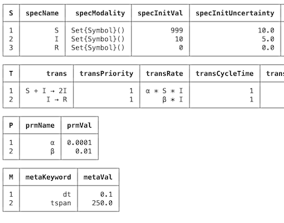
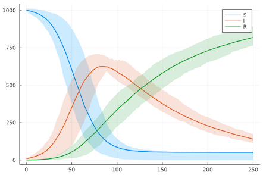
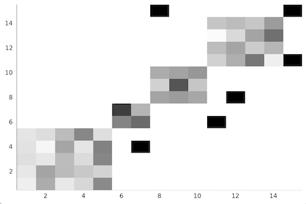
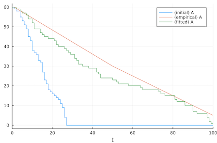

# ReactiveDynamics.jl <br> 

<p align="center">
   <br>
  <a href="#about">About</a> |
  <a href="#context">Context</a> |
  <a href="#three-sketches">Three Sketches</a> |
  <a href="#interface-documentation">Interface Documentation</a>
</p>

## About

A novel computational framework for learning, designing, integrating, simulating, and optimizing R&D process models, to better inform strategic decisions in science and business. Also known as *Dynamics of Value Evolution (DyVE)*.

The package provides a category of reaction (transportation) network-type problems formalized on top of the **[generalized algebraic theory](https://ncatlab.org/nlab/show/generalized+algebraic+theory)**, and is compatible with the **[SciML](https://sciml.ai/)** ecosystem.

Our motivation stems from the area of **[system dynamics](https://www.youtube.com/watch?v=o-Yp8A7BPE8)**, which is a mathematical modeling approach to frame, analyze, and optimize complex (nonlinear) dynamical systems, to augment the strategy and policy design.

</a>
<p>The central concept is of a <b>transition</b> (transport, flow, rule, reaction - a subcategory of general algebraic action). Generally, a transition prescribes a stochastic rule which repeatedly transforms the modeled system's <b>resources</b>. An elementary instance of such an ontology is provided by chemical reaction networks.

A <b>reaction network</b> (system modeled) is then a tuple $(T, R)$, where $T$ is a set of the transitions and $R$ is a set of the network's resource classes (aka species). The simultaneous action of transitions on the resources evolves the dynamical system.

The transitions are generally **stateful** (i.e., act over a period of time). Moreover, at each time step a quantum of the a transition's instances is brought into the scope, where the size of the batch is drived by a Poisson counting process. A transition takes the from `rate, a*A + b*B + ... --> c*C + ...`, where `rate` gives the expected batch size per time unit. `A`, `B`, etc., are the resources, and `a`, `b`, etc., are the generalized stoichiometry coefficients. Note that both `rate` and the "coefficients" can in fact be given by a function which depends on the system's instantaneous state (stochastic, in general). In particular, even the structural form of a transition can be stochastic, as will be demonstrated shortly.
</p>

An instance of a stateful transition evolves gradually from its genesis up to the terminal point, where the products on the instance's right hand-side are put into the system. An instance advances proportionally to the quantity of resources allocated. To understand this behavior, we note that the system's resource classes (or occurences of a resource class in a transition) may be assigned a **modality**; a modality governs the interaction between the resource and the transition, as well as the interpretation of the generalized stoichiometry coefficient.

In particular, a resource can be allocated to an instance either for the instance's lifetime or a single time step of the model's evolution (after each time step, the resource may be reallocated based on the global demand). Moreover, the coefficient of a resource on the left hand-side can either be interpreted as a total amount of the resource required or as an amount required per time unit. Similarly, it is possible to declare a resource **conserved**, in which case it is returned into the scope once the instance terminates.

</a>

The transitions are <b>parametric</b>. That is, it is possible to set the period over which an instance of a transition acts in the system (as well as the maximal period of this action), the total number of transition's instances allowed to exist in the system, etc. An annotated transition takes the form `rate, a*A + b*B + ... --> c*C + ..., prm => val, ...`, where the numerical values can be given by a function which depends on the system's state. Internally, the reaction network is represented as an <a href=https://algebraicjulia.github.io/Catlab.jl/dev/generated/wiring_diagrams/wd_cset/><b>attributed C-set</b></a>.

A network's dynamics is specified using a compact **modeling metalanguage**. Moreover, we have integrated another expression comprehension metalanguage which makes it easy to generate arbitrarily complex dynamics from a single template transition!

Taking **unions** of reaction networks is fully supported, and it is possible to identify the resource classes as apropriate.

Moreover, it is possible to **export and import** reaction network dynamics using the [TOML](https://toml.io/) format.

Once a network's dynamics is specified, it can be converted to a problem and simulated. The exported problem is a **`DiscreteProblem`** compatible with **[DifferentialEquations.jl](https://diffeq.sciml.ai/stable/)** ecosystem, and hence the latter package's all powerful capabilities are available. For better user experience, we have tailored and exported many of the functionalities within the modeling metalanguage, including ensemble analysis, parameter optimization, parameter inference, etc. Would you guess that **[universal differential equations](https://arxiv.org/abs/2001.04385)** are supported? If even the dynamics is unknown, you may just infer it!


## Context

As the package evolves, several functionalities have matured enough to become a standalone package.

This includes **[GeneratedExpressions.jl](https://github.com/Merck/GeneratedExpressions.jl)**, a metalanguage to support code-less expression comprehensions. The package compact generation of the transitions.

Another package is **OperadicAgents.jl**, a lightweight package to enable hierarchical, heterogeneous dynamical systems co-integration. It implements a highly scalable, fully customizable interface (an operad) featuring sums and compositions of dynamical systems. In present context, we note it can be used to co-integrate a reaction network problem with, e.g., a stochastic ordinary differential problem!

## Three Sketches

For other examples, see the **[tutorials](tutorial)**.

### SIR Model

The acronym SIR stands for susceptible, infected, and recovered, and as such the SIR model attempts to capture the dynamics of disease spread. We express the SIR dynamics as a reaction network using the compact modeling metalanguage. 

Follow the SIR model's reactions:

<p align="center">
   <br>
</p>

```julia
using ReactiveDynamics

# model dynamics
sir_acs = @ReactionNetwork begin
        α*S*I, S+I --> 2I, cycle_time=>0, name=>I2R
        β*I, I --> R, cycle_time=>0, name=>R2S 
end

# simulation parameters
## initial values
@prob_init sir_acs S=999 I=10 R=0
## uncertainty in initial values (Gaussian)
@prob_uncertainty sir_acs S=10. I=5.
## parameters
@prob_params sir_acs α=0.0001 β=0.01
## other arguments passed to the solver
@prob_meta sir_acs tspan=250 dt=.1
```

The resulting reaction network is represented as an attributed C-set:



Next we solve the problem.

```
# turn model into a problem
prob = @problematize sir_acs

# solve the problem over multiple trajectories
sol = @solve prob trajectories=20

# plot the solution
@plot sol plot_type=summary
## show only species S
@plot sol plot_type=summary show=:S
## plot evolution over (0., 100.) in green (propagates to Plots.jl)
@plot sol plot_type=summary c=:green xlimits=(.0, 100.)
```



### Sparse Interactions

We introduce a complex reaction network as a union of $n_{\text{models}}$ reaction networks, where the off-diagonal interactions are sparse.

To harness the capabilities of **GeneratedExpressions.jl**, let us first declare a template atomic model.

```julia
# submodel.jl
# substitute $r as the global number of resources, $i as the submodel identifier
@register begin 
        push!(ns, rand(1:5)); ϵ = 10e-2
        push!(M, rand(ns[$i], ns[$i])); foreach(i -> M[$i][i, i] += ϵ, 1:ns[$i])
        foreach(i -> M[$i][i, :] /= sum(M[$i][i, :]), 1:ns[$i])
        push!(cycle_times, rand(1:5, ns[$i], ns[$i]))
        push!(demand, rand(1:10, ns[$i], ns[$i], $r)); push!(production, rand(1:10, ns[$i], ns[$i], $r))
end
    
# generate submodel dynamics
push!(rd_models, @ReactionNetwork begin
                M[$i][$m, $n], state[$m] + {demand[$i][$m, $n, $l]*resource[$l], l=1:$r, dlm=+} --> state[$n] + 
                        {production[$i][$m, $n, $l]*resource[$l], l=1:$r, dlm=+}, cycle_time=>cycle_times[$i][$m, $n], probability_of_success=>$m*$n/(n[$i])^2
        end m=1:ReactiveDynamics.ns[$i] n=1:ReactiveDynamics.ns[$i]
)
```

The next step is to instantiate the atomic models (submodels).

```julia
using ReactiveDynamics
## setup the environment
rd_models = ReactiveDynamics.ReactionNetwork[] # submodels

# needs to live within ReactiveDynamics's scope
# the arrays will contain the submodel
@register begin
    ns = Int[] # size of submodels
    M = Array[] # transition intensities of submodels
    cycle_times = Array[] # cycle times of transitions in submodels
    demand = Array[]; production = Array[] # resource production / generation for transitions in submodels
end
```

Load $n_{\text{models}}$ the atomic models (substituting into `submodel.jl`):

```julia
n_models = 5; r = 2 # number of submodels, resources

# submodels: dense interactions
@generate {@fileval(submodel.jl, i=$i, r=r), i=1:n_models}
```

We take union of the atomic models, and we identify common resources.

```julia
# batch join over the submodels
rd_model = @generate "@join {rd_models[\$i], i=1:n_models, dlm=' '}"

# identify resources
@generate {@equalize(rd_model, @alias(resource[$j])={rd_models[$i].resource[$j], i=1:n_models, dlm=:(=)}), j=1:r}
```

Next step is to add some off-diagonal interactions.

```julia
# sparse off-diagonal interactions, sparse declaration
# again, we use GeneratedExpressions.jl
sparse_off_diagonal = zeros(sum(ReactiveDynamics.ns), sum(ReactiveDynamics.ns))
for i in 1:n_models
    j = rand(setdiff(1:n_models, (i, )))
    i_ix = rand(1:ReactiveDynamics.ns[i]); j_ix = rand(1:ReactiveDynamics.ns[j])
    sparse_off_diagonal[i_ix+sum(ReactiveDynamics.ns[1:i-1]), j_ix+sum(ReactiveDynamics.ns[1:j-1])] += 1
    interaction_ex = """@push rd_model begin 1., var"rd_models[$i].state[$i_ix]" --> var"rd_models[$j]__state[$j_ix]" end"""
    eval(Meta.parseall(interaction_ex))
end
```

Let's plot the interactions:



The resulting model can then be conveniently simulated using the modeling metalanguage.

```julia
using ReactiveDynamics: nparts
u0 = rand(1:1000, nparts(rd_model, :S))
@prob_init rd_model u0

@prob_meta rd_model tspan=10

prob = @problematize rd_model
sol = @solve prob trajectories=2

# plot "state" species only
@plot sol plot_type=summary show=r"state"
```

### Universal Differential Equations: Fitting Unknown Dynamics

We demonstrate how to fit unknown part of dynamics to empirical data.

We use `@register` to define a simple linear function within the scope of module `ReactiveDynamics`; parameters of the function will be then optimized for. Note that `function_to_learn` can be generally replaced with a neural network (Flux chain), etc.

```julia
## some embedded function (neural network, etc.)
@register begin
    function function_to_learn(A, B, C, params)
        [A, B, C]' * params # params: 3-element vector
    end
end
```

Next we set up a simple dynamics and supply initial parameters.

```julia
acs = @ReactionNetwork begin
    function_to_learn(A, B, C, params), A --> B+C
    1., B --> C
    2., C --> B
end

# initial values, check params
@prob_init acs A=60. B=10. C=150.
@prob_params acs params=[.01, .01, .01]
@prob_meta acs tspan=100.
```

Let's next see the numerical results for the initial guess.

```julia
sol = @solve acs
@plot sol
```


Next we supply empirical data and fit `params`.

```julia
time_points = [1, 50, 100]
data = [60 30 5]

@fit_and_plot acs data time_points vars=[A] params α maxeval=200 lower_bounds=0 upper_bounds=.01
```



## Interface Documentation

<a id='Create-a-Model'></a>

<a id='Create-a-Model-1'></a>

### Create a Model

<a id='ReactiveDynamics.@ReactionNetwork' href='#ReactiveDynamics.@ReactionNetwork'>#</a>
**`ReactiveDynamics.@ReactionNetwork`** &mdash; *Macro*.


Macro that takes an expression corresponding to a reaction network and outputs an instance of `TheoryReactionNetwork` that can be converted to a `DiscreteProblem` or solved directly.

Most arrows accepted (both right, left, and bi-drectional arrows). Use 0 or ∅ for annihilation/creation to/from nothing.

Custom functions and sampleable objects can be used as numeric parameters. Note that these have to be accessible from ReactiveDynamics's source code.

**Examples**

```julia
acs = @ReactionNetwork begin
    1.0, X ⟶ Y
    1.0, X ⟶ Y, priority=>6., prob=>.7, capacity=>3.
    1.0, ∅ --> (Poisson(.3γ)X, Poisson(.5)Y)
    (XY > 100) && (XY -= 1)
end
@push acs 1.0 X ⟶ Y 
@prob_init acs X=1 Y=2 XY=α
@prob_params acs γ=1 α=4
@solve_and_plot acs
```


<a id='Update-Model-Objects'></a>

<a id='Update-Model-Objects-1'></a>

### Update Model Objects

<a id='ReactiveDynamics.@add_species' href='#ReactiveDynamics.@add_species'>#</a>
**`ReactiveDynamics.@add_species`** &mdash; *Macro*.


Add new species to a model.

**Examples**

```julia
@add_species acs S I R
```

<a id='ReactiveDynamics.@aka' href='#ReactiveDynamics.@aka'>#</a>
**`ReactiveDynamics.@aka`** &mdash; *Macro*.


Alias object name in an acs.

**Default names**

| name       | short name |
|:---------- |:---------- |
| species    | S          |
| transition | T          |
| action     | A          |
| event      | E          |
| param      | P          |
| meta       | M          |

**Examples**

```julia
@aka acs species=resource transition=reaction
```

<a id='ReactiveDynamics.@mode' href='#ReactiveDynamics.@mode'>#</a>
**`ReactiveDynamics.@mode`** &mdash; *Macro*.


Set species modality.

**Supported modalities**

  * nonblock
  * conserved
  * rate

**Examples**

```julia
@mode acs (r"proj\w+", r"experimental\w+") conserved
@mode acs (S, I) conserved
@mode acs S conserved
```

<a id='ReactiveDynamics.@name_transition' href='#ReactiveDynamics.@name_transition'>#</a>
**`ReactiveDynamics.@name_transition`** &mdash; *Macro*.


Set name of a transition in the model.

**Examples**

```julia
@name_transition acs 1="name"
@name_transition acs name="transition_name"
@name_transition acs "name"="transition_name"
```


<a id='Resource-Costs'></a>

<a id='Resource-Costs-1'></a>

#### Resource Costs

<a id='ReactiveDynamics.@cost' href='#ReactiveDynamics.@cost'>#</a>
**`ReactiveDynamics.@cost`** &mdash; *Macro*.


Set cost.

**Examples**

```julia
@cost model experimental1=2 experimental2=3
```

<a id='ReactiveDynamics.@valuation' href='#ReactiveDynamics.@valuation'>#</a>
**`ReactiveDynamics.@valuation`** &mdash; *Macro*.


Set valuation.

**Examples**

```julia
@valuation model experimental1=2 experimental2=3
```

<a id='ReactiveDynamics.@reward' href='#ReactiveDynamics.@reward'>#</a>
**`ReactiveDynamics.@reward`** &mdash; *Macro*.


Set reward.

**Examples**

```julia
@reward model experimental1=2 experimental2=3
```


<a id='Add-Reactions'></a>

<a id='Add-Reactions-1'></a>

### Add Reactions

<a id='ReactiveDynamics.@push' href='#ReactiveDynamics.@push'>#</a>
**`ReactiveDynamics.@push`** &mdash; *Macro*.


Add reactions to an acset.

**Examples**

```julia
@push sir_acs β*S*I*tdecay(@time()) S+I --> 2I name=>SI2I
@push sir_acs begin 
    ν*I, I --> R, name=>I2R
    γ, R --> S, name=>R2S
end
```

<a id='ReactiveDynamics.@jump' href='#ReactiveDynamics.@jump'>#</a>
**`ReactiveDynamics.@jump`** &mdash; *Macro*.


Add a jump process (with specified Poisson intensity per unit time step) to a model.

**Examples**

```julia
@jump acs λ Z += rand(Poisson(1.))
```

<a id='ReactiveDynamics.@periodic' href='#ReactiveDynamics.@periodic'>#</a>
**`ReactiveDynamics.@periodic`** &mdash; *Macro*.


Add a periodic callback to a model.

**Examples**

```julia
@periodic acs 1. X += 1
```


<a id='Set-Initial-Values,-Uncertainty,-and-Solver-Arguments'></a>

<a id='Set-Initial-Values,-Uncertainty,-and-Solver-Arguments-1'></a>

### Set Initial Values, Uncertainty, and Solver Arguments

<a id='ReactiveDynamics.@prob_init' href='#ReactiveDynamics.@prob_init'>#</a>
**`ReactiveDynamics.@prob_init`** &mdash; *Macro*.


Set initial values of species in an acset.

**Examples**

```julia
@prob_init acs X=1 Y=2 Z=h(α)
@prob_init acs [1., 2., 3.]
```

<a id='ReactiveDynamics.@prob_uncertainty' href='#ReactiveDynamics.@prob_uncertainty'>#</a>
**`ReactiveDynamics.@prob_uncertainty`** &mdash; *Macro*.


Set uncertainty in initial values of species in an acset (stderr).

**Examples**

```julia
@prob_uncertainty acs X=.1 Y=.2
@prob_uncertainty acs [.1, .2,]
```

<a id='ReactiveDynamics.@prob_params' href='#ReactiveDynamics.@prob_params'>#</a>
**`ReactiveDynamics.@prob_params`** &mdash; *Macro*.


Set parameter values in an acset.

**Examples**

```julia
@prob_params acs α=1. β=2.
```

<a id='ReactiveDynamics.@prob_meta' href='#ReactiveDynamics.@prob_meta'>#</a>
**`ReactiveDynamics.@prob_meta`** &mdash; *Macro*.


Set model metadata (e.g. solver arguments)

**Examples**

```julia
@prob_meta acs tspan=(0, 100.) schedule=schedule_weighted!
@prob_meta sir_acs tspan=250 tstep=1
```


<a id='Model-Unions'></a>

<a id='Model-Unions-1'></a>

### Model Unions

<a id='ReactiveDynamics.@join' href='#ReactiveDynamics.@join'>#</a>
**`ReactiveDynamics.@join`** &mdash; *Macro*.


```julia
@join models... [equalize...]
```

Performs join of models and identifies model variables, as specified.

Model variables / parameter values and metadata are propagated; the last model takes precedence.

**Examples**

```julia
@join acs1 acs2 @catchall(A)=acs2.Z @catchall(XY) @catchall(B)
```

<a id='ReactiveDynamics.@equalize' href='#ReactiveDynamics.@equalize'>#</a>
**`ReactiveDynamics.@equalize`** &mdash; *Macro*.


Identify (collapse) a set of species in a model.

**Examples**

```julia
@join acs acs1.A=acs2.A B=C
```


<a id='Model-Import-and-Export'></a>

<a id='Model-Import-and-Export-1'></a>

### Model Import and Export

<a id='ReactiveDynamics.@import_model' href='#ReactiveDynamics.@import_model'>#</a>
**`ReactiveDynamics.@import_model`** &mdash; *Macro*.


Import a model from a file.

**Examples**

```julia
@import_model "model.toml"
```

<a id='ReactiveDynamics.@export_model' href='#ReactiveDynamics.@export_model'>#</a>
**`ReactiveDynamics.@export_model`** &mdash; *Macro*.


Export model to a file.

**Examples**

```julia
@export_model acs "acs_data.toml"
```


<a id='Solution-Import-and-Export'></a>

<a id='Solution-Import-and-Export-1'></a>

### Solution Import and Export

<a id='ReactiveDynamics.@import_solution' href='#ReactiveDynamics.@import_solution'>#</a>
**`ReactiveDynamics.@import_solution`** &mdash; *Macro*.


```julia
@import_solution "sol.jld2"
@import_solution "sol.jld2" sol
```

Import a solution from a file.

**Examples**

```julia
@import_solution "sir_acs_sol/serialized/sol.jld2"
```

<a id='ReactiveDynamics.@export_as_table' href='#ReactiveDynamics.@export_as_table'>#</a>
**`ReactiveDynamics.@export_as_table`** &mdash; *Macro*.


```julia
@export_as_table sol
```

Export a solution as a `DataFrame`.

**Examples**

```julia
@export_as_table sol
```

<a id='ReactiveDynamics.@export_csv' href='#ReactiveDynamics.@export_csv'>#</a>
**`ReactiveDynamics.@export_csv`** &mdash; *Macro*.


```julia
@export_csv sol
@export_csv sol "sol.csv"
```

Export a solution to a file.

**Examples**

```julia
@export_csv sol "sol.csv"
```

<a id='ReactiveDynamics.@export_solution' href='#ReactiveDynamics.@export_solution'>#</a>
**`ReactiveDynamics.@export_solution`** &mdash; *Macro*.


```julia
@export_solution sol
@export_solution sol "sol.jld2"
```

Export a solution to a file.

**Examples**

```julia
@export_solution sol "sol.jdl2"
```


<a id='Problematize,-Solve,-and-Plot'></a>

<a id='Problematize,-Solve,-and-Plot-1'></a>

### Problematize, Solve, and Plot

<a id='ReactiveDynamics.@problematize' href='#ReactiveDynamics.@problematize'>#</a>
**`ReactiveDynamics.@problematize`** &mdash; *Macro*.


Convert a model to a `DiscreteProblem`. If passed a problem instance, return the instance.

**Examples**

```julia
@problematize acs tspan=1:100
```

<a id='ReactiveDynamics.@solve' href='#ReactiveDynamics.@solve'>#</a>
**`ReactiveDynamics.@solve`** &mdash; *Macro*.


Solve the problem. Solverargs passed at the calltime take precedence.

**Examples**

```julia
@solve prob
@solve prob tspan=1:100
@solve prob tspan=100 trajectories=20
```

<a id='ReactiveDynamics.@plot' href='#ReactiveDynamics.@plot'>#</a>
**`ReactiveDynamics.@plot`** &mdash; *Macro*.


Plot the solution (summary).

**Examples**

```julia
@plot sol plot_type=summary
@plot sol plot_type=allocation # not supported for ensemble solutions!
@plot sol plot_type=valuations # not supported for ensemble solutions!
@plot sol plot_type=new_transitions # not supported for ensemble solutions!
```


<a id='Optimization-and-Fitting'></a>

<a id='Optimization-and-Fitting-1'></a>

### Optimization and Fitting

<a id='ReactiveDynamics.@optimize' href='#ReactiveDynamics.@optimize'>#</a>
**`ReactiveDynamics.@optimize`** &mdash; *Macro*.


```julia
@optimize acset objective <free_var=[init_val]>... <free_prm=[init_val]>... opts...
```

Take an acset and optimize given functional.

Objective is an expression which may reference the model's variables and parameters, i.e., `A+β`. The values to optimized are listed using their symbolic names; unless specified, the initial value is inferred from the model. The vector of free variables passed to the `NLopt` solver has the form `[free_vars; free_params]`; order of vars and params, respectively, is preserved. 

By default, the functional is minimized. Specify `objective=max` to perform maximization. 

Propagates `NLopt` solver arguments; see [NLopt documentation](https://github.com/JuliaOpt/NLopt.jl).

**Examples**

```julia
@optimize acs abs(A-B) A B=20. α=2. lower_bounds=0 upper_bounds=100
@optimize acss abs(A-B) A B=20. α=2. upper_bounds=[200,300,400] maxeval=200 objective=min
```

<a id='ReactiveDynamics.@fit' href='#ReactiveDynamics.@fit'>#</a>
**`ReactiveDynamics.@fit`** &mdash; *Macro*.


```julia
@fit acset data_points time_steps empiric_variables <free_var=[init_val]>... <free_prm=[init_val]>... opts...
```

Take an acset and fit initial values and parameters to empirical data.

The values to optimized are listed using their symbolic names; unless specified, the initial value is inferred from the model. The vector of free variables passed to the `NLopt` solver has the form `[free_vars; free_params]`; order of vars and params, respectively, is preserved. 

Propagates `NLopt` solver arguments; see [NLopt documentation](https://github.com/JuliaOpt/NLopt.jl).

**Examples**

```julia
t = [1, 50, 100]
data = [80 30 20]
@fit acs data t vars=A B=20 A α # fit B, A, α; empirical data is for variable A
```

<a id='ReactiveDynamics.@fit_and_plot' href='#ReactiveDynamics.@fit_and_plot'>#</a>
**`ReactiveDynamics.@fit_and_plot`** &mdash; *Macro*.


```julia
@fit acset data_points time_steps empiric_variables <free_var=[init_val]>... <free_prm=[init_val]>... opts...
```

Take an acset, fit initial values and parameters to empirical data, and plot the result.

The values to optimized are listed using their symbolic names; unless specified, the initial value is inferred from the model. The vector of free variables passed to the `NLopt` solver has the form `[free_vars; free_params]`; order of vars and params, respectively, is preserved. 

Propagates `NLopt` solver arguments; see [NLopt documentation](https://github.com/JuliaOpt/NLopt.jl).

**Examples**

```julia
t = [1, 50, 100]
data = [80 30 20]
@fit acs data t vars=A B=20 A α # fit B, A, α; empirical data is for variable A
```

<a id='ReactiveDynamics.@build_solver' href='#ReactiveDynamics.@build_solver'>#</a>
**`ReactiveDynamics.@build_solver`** &mdash; *Macro*.


```julia
@build_solver acset <free_var=[init_val]>... <free_prm=[init_val]>... opts...
```

Take an acset and export a solution as a function of free vars and free parameters.

**Examples**

```julia
solver = @build_solver acs S α β # function of variable S and parameters α, β
solver([S, α, β])
```